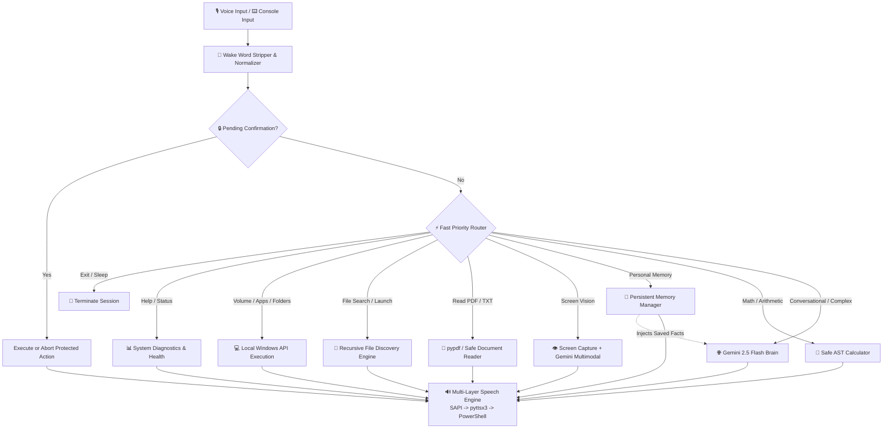

# 🤖 J.A.R.V.I.S — Personal AI Desktop Voice Assistant

<div align="center">

[](https://www.python.org/)
[](https://aistudio.google.com/)
[](https://www.microsoft.com/windows)
[](LICENSE)
[](https://github.com/szeeshanZ123/JARVIS)

**An intelligent, lightweight, and secure personal desktop AI voice assistant for Windows powered by Google Gemini AI.**  
*Equipped with persistent memory, multimodal screen vision, safe system controls, PDF and text extraction with AI summarization, recursive file discovery, and multi-tier speech synthesis.*

[Features](#-key-features) • [Architecture](#-architecture) • [Getting Started](#-getting-started) • [Command Reference](#-command-reference) • [Configuration](#-configuration) • [Testing](#-running-tests) • [Troubleshooting](#-troubleshooting)

</div>

---

## ⚡ Overview

**J.A.R.V.I.S (Just A Rather Very Intelligent System)** is designed to act as your true desktop companion. Unlike cloud-only voice assistants, J.A.R.V.I.S combines local Windows system automation with the reasoning power of Google Gemini. It executes local operations (app launching, folder navigation, volume adjustments, file search, hardware diagnostics, and document reading) instantly without cloud latency, while routing complex natural conversations and visual analysis to Gemini 2.5 Flash with rolling context and persistent memory.

---

## ✨ Key Features

### 🧠 Persistent Personal Memory
- **Disk-backed Storage (`jarvis_memory.json`)**: Remembers facts about you across sessions (*"Remember that my favorite language is Python"*, *"What project am I working on?"*).
- **Targeted & Natural Recall**: Automatically queries memory via fast semantic matching or Gemini-grounded reasoning.
- **Selective Forgetting & Confirmation Safeguards**: Safely removes individual items or requests confirmation before destructive actions like memory wipe.

### 👁️ Screen Vision (Multimodal AI)
- Captures temporary high-resolution screen buffers and analyzes the active workflow using Google Gemini Vision.
- Understands open editors, web pages, code snippets, and active workspace states (*"Jarvis, look at my screen"*, *"What is currently open?"*).

### 📄 Smart Document Reading & Summarization
- **PDF Extraction (`pypdf`)**: Reads and parses real multi-page PDF documents and produces concise voice-friendly AI summaries (*"Read GST assignment PDF"*).
- **Safe Text Reading**: Reads `.txt`, `.md`, `.py`, `.csv`, `.json`, `.log`, `.yaml`, `.ini` files safely without code execution.
- **Contextual Pronouns**: Seamlessly refer to search results using natural phrasing (*"Read it"*, *"Summarize that"*, *"Show me the largest one"*).

### 🔎 Recursive User File Discovery & Launching
- Fast recursive search across user directories (`Desktop`, `Documents`, `Downloads`, `Pictures`, `Videos`, `Music`, `OneDrive`).
- Bounded search depth and intelligent extension resolution (*"Find my Python files"*, *"Where is my resume.pdf"*, *"Open resume.pdf"*).

### 🚀 Safe Application & Folder Launching
- Whitelisted, sandboxed launching of popular applications (Chrome, VS Code, Spotify, Discord, WhatsApp, Terminal, Task Manager, Paint, Calculator, etc.).
- Direct standard folder navigation in Windows File Explorer (*"Open Downloads"*, *"Open Documents"*).
- Direct website launching (*"Open YouTube"*, *"Go to GitHub"*, *"Open reddit.com"*).

### 🔊 Windows System Volume Control
- Master volume adjustments via native Windows API and optional `pycaw` (*"Increase volume"*, *"Mute volume"*, *"Set volume to 50%"*).

### 🎙️ Multi-Backend Voice & Multi-Layer TTS
- **Audio Capture**: Automatically detects and leverages `sounddevice` (zero-driver dependency) or `PyAudio`, with seamless fallback to interactive console input.
- **Zero-Latency TTS**: Tier 1 native Windows SAPI COM voice (`win32com`), Tier 2 `pyttsx3`, and Tier 3 PowerShell `System.Speech` synthesizer fallback.

### 🛡️ Sandboxing & AST Calculator
- **Safe Math Engine**: Evaluates complex arithmetic via Python Abstract Syntax Tree (AST) without dangerous `eval()` execution.
- **Confirmation Guards**: Protects against accidental data loss.
- **Privacy-First**: Credentials (`.env`) and personal data (`jarvis_memory.json`) are ignored by version control.

---

## 🏗️ Architecture



---

## 🛠️ Project Structure

```
JARVIS/
├── .env.example          # Sample environment configuration template
├── .gitignore            # Git exclusion rules (protects .env & memory)
├── LICENSE               # MIT Open-Source License
├── README.md             # Project documentation & reference
├── jarvis.py             # Main assistant engine & priority router
├── jarvis_memory.json    # Local persistent memory storage (created automatically)
├── requirements.txt      # Python package dependencies
└── test_jarvis.py        # Comprehensive automated router test suite
```

---

## 🚀 Getting Started

### 1. Prerequisites
- **Operating System**: Windows 10 or Windows 11 (64-bit recommended)
- **Python**: Python 3.9, 3.10, 3.11, or 3.12
- **Google Gemini API Key**: Free tier available from [Google AI Studio](https://aistudio.google.com/)

---

### 2. Installation

1. **Clone the repository:**
   ```bash
   git clone https://github.com/szeeshanZ123/JARVIS.git
   cd JARVIS
   ```

2. **Create and activate a virtual environment (recommended):**
   ```bash
   python -m venv venv
   .\venv\Scripts\activate
   ```

3. **Install dependencies:**
   ```bash
   pip install -r requirements.txt
   ```

> [!TIP]
> **Audio Input Note:** `sounddevice` and `SpeechRecognition` are included in `requirements.txt` and provide out-of-the-box microphone support without external C++ compilers. If you prefer `PyAudio`, you can install it via `pip install PyAudio`. If no microphone is detected, JARVIS automatically switches to interactive keyboard console mode.

---

### 3. Configuration

1. Copy the example environment file:
   ```bash
   copy .env.example .env
   ```
   *(or `cp .env.example .env` in PowerShell / Git Bash)*

2. Open `.env` in any editor and provide your Gemini API key:
   ```env
   GEMINI_API_KEY=AIzaSy...your_gemini_api_key_here
   ```

---

### 4. Running JARVIS

Launch the assistant:
```bash
python jarvis.py
```

Upon launch, JARVIS displays a diagnostics startup banner and greets you:
```
========================================
             J.A.R.V.I.S V2
          PERSONAL AI ASSISTANT
========================================
STATUS: ONLINE
AI: CONNECTED
VOICE: READY (Realtek Audio)
MEMORY: READY
MEMORIES: 3
SYSTEM: READY
========================================

JARVIS: Good afternoon. JARVIS V2 is online. How may I assist you?
```

---

## 🗣️ Command Reference

JARVIS supports natural phrasing. You can talk to JARVIS or type your queries directly:

| Category | Example Commands | Behavior |
| :--- | :--- | :--- |
| **🧠 Memory & Facts** | `Remember that my name is Zeeshan`<br>`Remember that my main project is Vision Lens`<br>`What is my name?`<br>`What do you remember about me?`<br>`Forget that my favorite language is Python`<br>`Clear all my memory` | Saves/recalls personal context to `jarvis_memory.json`. Requests confirmation before clearing. |
| **👁️ Screen Vision** | `Look at my screen`<br>`What is on my screen?`<br>`What window do I have open?` | Captures temporary screen frame and explains visual state via Gemini Multimodal. |
| **📄 PDF & Document Reading** | `Read my GST assignment PDF`<br>`Summarize GST assignment`<br>`Read requirements.txt`<br>`Read it` *(contextual)*<br>`Summarize that` *(contextual)* | Extracts text via `pypdf` or text reader and produces concise AI summary. |
| **🔎 File Search & Discovery** | `Find my Python files`<br>`Find resume.pdf`<br>`Search Week 4 video in Downloads`<br>`Open resume.pdf`<br>`Open the first one`<br>`Show me the largest one` | Recursively searches user folders and supports natural contextual references. |
| **🚀 App & Folder Launching** | `Open Chrome`<br>`Launch VS Code`<br>`Open Spotify`<br>`Open WhatsApp`<br>`Open Downloads`<br>`Open Documents` | Opens registered Windows apps or native File Explorer directories. |
| **🌐 Web & YouTube** | `Open YouTube`<br>`Search YouTube for Python tutorial`<br>`Search Google for latest tech news`<br>`Open github.com` | Opens default web browser with targeted URLs or queries. |
| **🔊 Volume Control** | `Increase volume`<br>`Decrease volume`<br>`Mute volume`<br>`Set volume to 60%` | Controls Windows master volume endpoint directly. |
| **📊 Diagnostics & Health** | `System status`<br>`What is my CPU usage?`<br>`Check RAM usage`<br>`What OS am I running?`<br>`What time is it?`<br>`What is today's date?` | Returns live hardware stats, assistant connectivity, and date/time. |
| **🧮 Math & Calculation** | `Calculate 45 * 23`<br>`What is 25 percent of 800?`<br>`Calculate (1200 / 4) + 50` | Safely evaluates arithmetic expressions using AST parsing without `eval()`. |
| **📸 Screen Capture** | `Take a screenshot` | Captures and saves full screen to `Pictures/Screenshots/`. |
| **💡 Capabilities & Help** | `What can you do?`<br>`Help` | Displays a complete overview of active capabilities. |
| **👋 Exit** | `Goodbye`<br>`Go offline`<br>`Shutdown`<br>`Exit` | Closes the assistant session cleanly. |

---

## 🧪 Running Tests

A comprehensive router and confirmation test suite is included to verify all local command mappings and safety mechanisms without requiring live microphone input:

```bash
python test_jarvis.py
```

**Expected output:**
```
=== RUNNING JARVIS V2 COMMAND ROUTER TEST SUITE ===
...
=== TESTING CONFIRMATION SYSTEM ===
REQUEST CLEAR:  Are you sure you want to permanently clear all stored personal memories? Please reply 'yes' to confirm or 'no' to cancel.
CONFIRMATION:   All stored memories have been permanently cleared.
Confirmation test passed successfully!

ALL V2 TEST SCENARIOS PASSED SUCCESSFULLY!
```

---

## 🔧 Troubleshooting

<details>
<summary><b>Microphone not detected / Falling back to keyboard</b></summary>

- JARVIS uses `sounddevice` by default. Ensure your recording device is enabled in Windows Sound Settings (`Settings > System > Sound > Input`).
- If you wish to use `PyAudio` instead:
  ```bash
  pip install PyAudio
  ```
- If neither audio backend is available, JARVIS gracefully falls back to interactive keyboard prompt (`You (type command): `) while maintaining speech output.
</details>

<details>
<summary><b>Gemini AI returns "Offline / Invalid API Key"</b></summary>

- Verify that your `.env` file exists in the project root and contains `GEMINI_API_KEY=your_actual_key`.
- Ensure there are no extra spaces or quotes around the key.
- Generate a new key from [Google AI Studio](https://aistudio.google.com/).
</details>

<details>
<summary><b>PDF extraction returns scanned / empty notice</b></summary>

- JARVIS uses `pypdf` for text extraction. Image-only or scanned PDFs without embedded text layers cannot be read with pure text extraction; JARVIS will gracefully notify you that the document is image-based.
</details>

<details>
<summary><b>Text-to-Speech (TTS) has no sound</b></summary>

- JARVIS uses Windows SAPI SpVoice by default. Verify that your default output audio device is not muted.
- Ensure `pywin32` is installed: `pip install pywin32`.
</details>

---

## 🔒 Security & Privacy

- **No Remote Arbitrary Execution**: JARVIS never executes untrusted shell commands or evaluates arbitrary Python scripts from model output.
- **Local AST Arithmetic**: Mathematical queries are parsed into structured abstract syntax trees to prevent code injection.
- **Protected Secrets**: API keys (`.env`) and local personal memories (`jarvis_memory.json`) are automatically ignored by `.gitignore`.
- **Confirmation Guards**: Sensitive actions (such as clearing persistent memory) require explicit affirmative confirmation before taking effect.

---

## 📄 License

This project is open-source software licensed under the [MIT License](LICENSE).

<div align="center">
<b>Made with ❤️ for intelligent desktop automation.</b>
</div>
